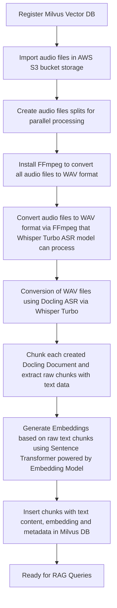

# Kubeflow Docling ASR Conversion Pipeline for RAG


This document explains the **Kubeflow Docling ASR (Automatic Speech Recognition) Conversion Pipeline** - a Kubeflow pipeline that processes audio files using Automatic Speech Recognition (ASR) with Docling to extract transcripts and generate embeddings for Retrieval-Augmented Generation (RAG) applications. The pipeline supports execution on both GPU and CPU-only nodes.


## Pipeline Overview
The pipeline transforms audio files into searchable vector embeddings through the following stages:




## Pipeline Components

### 1. **Vector Database Registration** (`register_vector_db`)
-  **Purpose**: Sets up the vector database with the proper configuration

### 2. **Audio Import** (`import_audio_files`)
-  **Purpose**: Downloads audio files from remote URLs.

### 3. **Audio Splitting** (`create_audio_splits`)
-  **Purpose**: Distributes audio files across multiple parallel workers for faster processing.

### 4. **ASR Conversion and Embedding Generation** (`docling_convert_and_ingest_audio`)
-  **Purpose**: Main processing component that transcribes audio, chunks the text, and generates vector embeddings.


## Supported Audio Formats

-  `.wav`
-  `.m4a`
-  `.mp3`
-  `.flac`
-  `.ogg`
-  `.aac`

In fact, Whisper model works exceptionally well with **WAV files**. It's the ideal format to use.

## Why WAV is the Best Choice

-  **Uncompressed Data**: WAV files contain raw, uncompressed audio data (PCM), which is exactly what the Whisper model needs to analyze the sound waves and perform transcription.

-  **Standardization**: You can easily save a WAV file with the precise specifications that Whisper was trained on: **16kHz sample rate** and a **single mono channel**. This consistency leads to the highest accuracy.

-  **No Decoding Needed**: When the model receives a properly formatted WAV file, it can process the audio directly without needing any external tools like FFmpeg to decode it first.

In short, providing Whisper with a 16kHz mono WAV file is giving it the exact type of data it was designed to read, which ensures the most reliable and accurate results.


## 🔄 RAG Query Flow
1.  **User Query** → Embedding Model → Query Vector
2.  **Vector Search** → Vector Database → Similar Transcript Chunks
3.  **Context Assembly** → Markdown Transcript Content + Timestamps
4.  **LLM Generation** → Final Answer with Context from Audio

The pipeline enables rich RAG applications that can answer questions about spoken content by leveraging the structured transcripts extracted from audio files.


## 🚀 Getting Started
### Prerequisites

- [Data Science Project in OpenShift AI with a configured Workbench](https://docs.redhat.com/en/documentation/red_hat_openshift_ai_cloud_service/1/html/getting_started)
- [Configuring a pipeline server](https://docs.redhat.com/en/documentation/red_hat_openshift_ai_self-managed/latest/html/working_with_data_science_pipelines/managing-data-science-pipelines_ds-pipelines#configuring-a-pipeline-server_ds-pipelines)
- A LlamaStack service with a vector database backend deployed (follow our [official deployment documentation](https://github.com/opendatahub-io/rag/blob/main/DEPLOYMENT.md))
-  `ffmpeg` dependency (note: this is installed automatically by the pipeline components).
- GPU-enabled nodes are highly recommended for faster processing.
- You can still use only CPU nodes but it will take longer time to execute pipeline.


**Pipeline Parameters**
-  `base_url`: URL where audio files are hosted
-  `audio_filenames`: Comma-separated list of audio files to process
-  `num_workers`: Number of parallel workers (default: 1)
-  `vector_db_id`: ID of the vector database to store embeddings
-  `service_url`: URL of the LlamaStack service
-  `embed_model_id`: Embedding model to use (default: `ibm-granite/granite-embedding-125m-english`)
-  `max_tokens`: Maximum tokens per chunk (default: 512)
-  `use_gpu`: Whether to use GPU for processing (default: true)
-  `clean_vector_db`: The vector database will be cleared during running the pipeline (default: false)


### Creating the Pipeline for running on GPU node


```
# Install dependencies for pipeline
cd demos/kfp/docling/asr-conversion
pip3 install -r requirements.txt

# Compile the Kubeflow pipeline for running with help of GPU or use existing pipeline
# set use_gpu = True in docling_convert_pipeline() in docling_asr_convert_pipeline.py
python3 docling_asr_convert_pipeline.py
```


### Creating the Pipeline for running on CPU only
```
# Install dependencies for pipeline
cd demos/kfp/docling/asr-conversion
pip3 install -r requirements.txt

# Compile the Kubeflow pipeline for running on CPU only or use existing pipeline
# set use_gpu = False in docling_convert_pipeline() in docling_asr_convert_pipeline.py
python3 docling_asr_convert_pipeline.py
```


### Import Kubeflow pipeline to OpenShift AI
- Import the compiled YAML to in Pipeline server in your Data Science project in OpenShift AI
- [Running a data science pipeline generated from Python code](https://docs.redhat.com/en/documentation/red_hat_openshift_ai_cloud_service/1/html/openshift_ai_tutorial_-_fraud_detection_example/implementing-pipelines#running-a-pipeline-generated-from-python-code)
- Configure the pipeline parameters as needed


### Query RAG Agent in your Workbench within a Data Science project on OpenShift AI
1. Open your Workbench
2. Clone the rag repo and use main branch
	- Use this link `https://github.com/opendatahub-io/rag.git` for cloning the repo
	- [Collaborating on Jupyter notebooks by using Git](https://docs.redhat.com/en/documentation/red_hat_openshift_ai_cloud_service/1/html/working_with_connected_applications/using_basic_workbenches#collaborating-on-jupyter-notebooks-by-using-git_connected-apps)


3. Install dependencies for Jupyter Notebook with RAG Agent
```
cd demos/kfp/docling/asr-conversion/rag-agent
pip3 install -r requirements.txt
```

4. Follow the instructions in the corresponding RAG Jupyter Notebook `asr_rag_agent.ipynb` to query the content ingested by the pipeline.