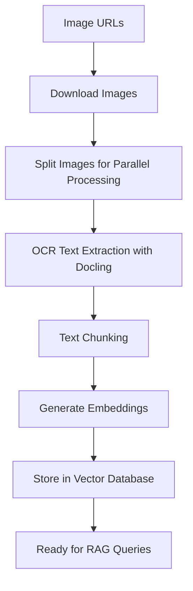

# Docling Image OCR Pipeline for RAG

 

This document explains the **Docling Image OCR Pipeline** (`docling_convert_images_pipeline_ocr_only.py`) - a Kubeflow pipeline that processes images using OCR with Docling to extract text and generate embeddings for Retrieval-Augmented Generation (RAG) applications.

  

  

## 🔄 Pipeline Overview

  

  

The pipeline transforms images into searchable vector embeddings through the following stages:

  

  



  

  

## 🏗️ Pipeline Components

  

  

### 1. **Vector Database Registration** (`register_vector_db`)

  

-  **Purpose**: Sets up the vector database with proper configuration

  

  

### 2. **Image Import** (`import_test_images`)

  

-  **Purpose**: Downloads images from remote URLs

  

### 3. **Image Splitting** (`create_image_splits`)

  

-  **Purpose**: Distributes images across parallel workers

  

-  **Process**: Splits images into equal batches for parallel processing

  

  

### 4. **OCR and Embedding Generation** (`docling_convert_and_ingest_images`)

  

-  **Purpose**: Main processing component - extracts text and generates embeddings

  
  
  


## ⚡ Models are in usage

  

  

### Inference Model that performs OCR:

  

-  **When**: During image processing

-  **Output**: Structured text with layout preservation

  

  

### Embedding Model:

  

-  **When**: During text chunk processing

-  **Output**: Dense vector representations

  
  
  

## 🔄 RAG Query Flow

  

  

1.  **User Query** → Embedding Model → Query Vector

  

2.  **Vector Search** → Milvus → Similar Chunks

  

3.  **Context Assembly** → Markdown Content + Metadata

  

4.  **LLM Generation** → Final Answer with Visual Context

  

  

The pipeline enables rich RAG applications that can answer questions about visual content by leveraging the structured text extracted from images.

  

  

## 🚀 Getting Started

  

  

### Prerequisites

  

- Project in OpenShift AI with workbench and pipeline server
Reference how to do that [here](https://rh-aiservices-bu.github.io/fraud-detection/fraud-detection-workshop/index.html)

  

- LlamaStack service with Milvus backend deloyed following [Default setup](https://github.com/opendatahub-io/rag/blob/main/DEPLOYMENT.md)

  

- GPU-enabled nodes (recommended)

  

  

### Running the Pipeline

  

```python
# Install requirements.txt
cd demos/kfp/docling/ocr-image-conversion  
pip3 install -r requirements.txt
  

# Compile the pipeline
python docling_convert_images_pipeline_ocr_only.py

# Upload and run the compiled YAML with Kubeflow pipeline in OpenShift AI

```

### Query RAG in your workbench within DS project in OpenShift AI

Follow instructions in `docling_images_rag.ipynb`