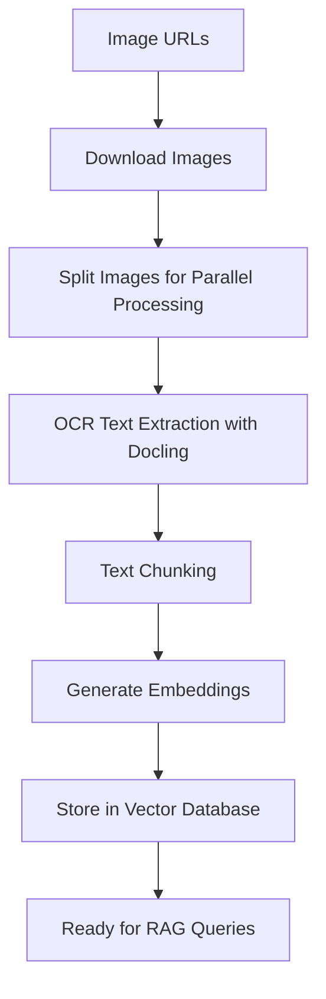

# Docling Image OCR Pipeline for RAG

  

This document explains the **Docling Image OCR Pipeline** (`docling_convert_images_pipeline_ocr_only.py`) - a Kubeflow pipeline that processes images using OCR with Docling to extract text and generate embeddings for Retrieval-Augmented Generation (RAG) applications.

  

## 🔄 Pipeline Overview

  

The pipeline transforms images into searchable vector embeddings through the following stages:

  



  

## 🏗️ Pipeline Components

  

### 1. **Vector Database Registration** (`register_vector_db`)

-  **Purpose**: Sets up the vector database with proper configuration

  

### 2. **Image Import** (`import_test_images`)

-  **Purpose**: Downloads images from remote URLs
  

### 3. **Image Splitting** (`create_image_splits`)

-  **Purpose**: Distributes images across parallel workers

-  **Process**: Splits images into equal batches for parallel processing

  

### 4. **OCR and Embedding Generation** (`docling_convert_images`)

-  **Purpose**: Main processing component - extracts text and generates embeddings


  

## 🔍 Main Processing Flow: `docling_convert_images`

  

### Phase 1: OCR Text Extraction (Inference Model)

  

```python

# Configure Docling for OCR

image_format_options =  ImageFormatOption(

do_ocr=True,

ocr_options=EasyOcrOptions(lang=["en"])

)

  

conv_results = doc_converter.convert_all(input_images)

```

  

**When Inference Model Works:**

-  **EasyOCR Model**: Runs during `doc_converter.convert_all()`

-  **Purpose**: Computer vision inference to detect and extract text from images

-  **Input**: Raw image pixels

-  **Output**: Structured document with extracted text in markdown format

-  **Resource Usage**: GPU-accelerated if available, processes images one by one

  

### Phase 2: Text Processing and Chunking

  

```python

for chunk in chunker.chunk(dl_doc=document):

raw_chunk = chunker.contextualize(chunk)

```

  

**Process:**

-  **Input**: Docling document with OCR'd text

-  **Chunking**: `HybridChunker` splits text into manageable pieces (max 512 tokens)

-  **Contextualization**: Adds markdown formatting and structure

-  **Output**: Markdown-formatted text chunks ready for embedding

  

### Phase 3: Embedding Generation (Embedding Model)

  

```python

embedding =  embed_text(raw_chunk, embedding_model)

# Uses SentenceTransformer to convert text to vectors

```

  

**When Embedding Model Works:**

-  **Model**: `ibm-granite/granite-embedding-125m-english` (SentenceTransformer)

-  **Purpose**: Converts text chunks into high-dimensional vectors

-  **Input**: Markdown-formatted text chunks

-  **Output**: 768-dimensional floating-point vectors

-  **Resource Usage**: GPU-accelerated if available, processes text sequentially

   


## ⚡ Models are in usage

  

### Inference Model that performs OCR:

-  **When**: During image processing
-  **Output**: Structured text with layout preservation

  

### Embedding Model:

-  **When**: During text chunk processing
-  **Output**: Dense vector representations

  


  
## 🔄 RAG Query Flow

  

1.  **User Query** → Embedding Model → Query Vector

2.  **Vector Search** → Milvus → Similar Chunks

3.  **Context Assembly** → Markdown Content + Metadata

4.  **LLM Generation** → Final Answer with Visual Context

  

The pipeline enables rich RAG applications that can answer questions about visual content by leveraging the structured text extracted from images.

  

## 🚀 Getting Started

  

### Prerequisites

- Kubeflow Pipelines environment

- LlamaStack service with Milvus backend

- GPU-enabled nodes (optional but recommended)

  

### Running the Pipeline

```python

# Compile the pipeline

python docling_convert_images_pipeline_ocr_only.py

  

# Upload and run the compiled YAML in Kubeflow

```

  
  

This pipeline transforms your image-based documents into a searchable knowledge base, enabling powerful multi-modal RAG applications! 🔍✨