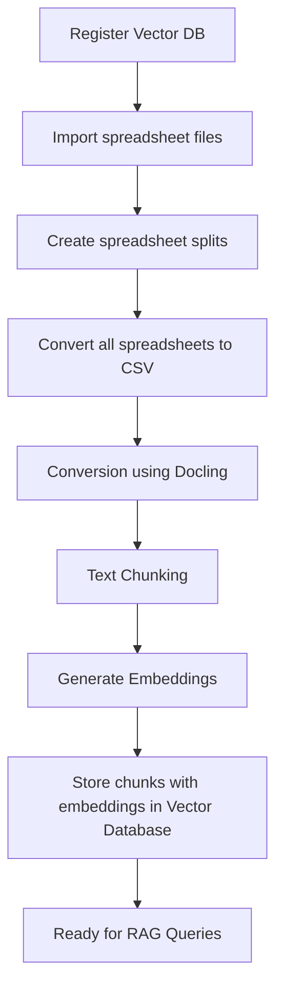

# Kubeflow Docling Spreadsheets Conversion Pipeline for RAG
This document explains the **Kubeflow Docling Spreadsheets Conversion Pipeline** - a Kubeflow pipeline that processes spreadsheets of different formats like "*.csv", "*.xlsx", "*.xls", "*.xlsm" with Docling to extract text and generate embeddings for Retrieval-Augmented Generation (RAG) applications. The pipeline supports execution on both GPU and CPU-only nodes.


## Pipeline Overview
The pipeline transforms spreadsheet files into searchable vector embeddings through the following stages:




## Pipeline Components

### 1. **Vector Database Registration** (`register_vector_db`)

-  **Purpose**: Sets up the vector database with the proper configuration.


### 2. **Spreadsheets Import** (`import_spreadsheet_files`)

-  **Purpose**: Downloads spreadsheet files from remote URLs.


### 3. **Spreadsheets Splitting** (`create_spreadsheet_splits`)

-  **Purpose**: Distributes spreadsheet files across multiple parallel workers for faster processing.


### 4. **Spreadsheet Conversion and Embedding Generation** (`docling_convert_and_ingest_spreadsheets`)


-  **Purpose**: Main processing component that extracts data from spreadsheet rows, chunks the text, and generates vector embeddings.

## Supported Spreadsheets Formats

-  `.csv`

-  `.xlsx`

-  `.xls`

-  `.xlsm`


## 🔄 RAG Query Flow

1.  **User Query** → Embedding Model → Query Vector

2.  **Vector Search** → Vector Database → Similar Data Chunks

4.  **Context Assembly** → Row Content + Source Metadata

5.  **LLM Generation** → Final Answer with Context from Spreadsheet


The pipeline enables rich RAG applications that can answer questions about spreadsheet content by leveraging the structured data extracted from spreadsheet files.


## 🚀 Getting Started

### Prerequisites
- [Data Science Project in OpenShift AI with a configured Workbench](https://docs.redhat.com/en/documentation/red_hat_openshift_ai_cloud_service/1/html/getting_started)

	- [Configuring a pipeline server](https://docs.redhat.com/en/documentation/red_hat_openshift_ai_self-managed/latest/html/working_with_data_science_pipelines/managing-data-science-pipelines_ds-pipelines#configuring-a-pipeline-server_ds-pipelines)

	- A LlamaStack service with a vector database backend deployed (follow our [official deployment documentation](https://github.com/opendatahub-io/rag/blob/main/DEPLOYMENT.md))

- GPU-enabled nodes are highly recommended for faster processing.
- You can still use only CPU nodes but it will take longer.


**Pipeline Parameters**

-  `base_url`: URL where spreadsheet files are hosted

-  `spreadsheet_filenames`: Comma-separated list of spreadsheet files to process

-  `num_workers`: Number of parallel workers (default: 1)

-  `vector_db_id`: ID of the vector database to store embeddings

-  `service_url`: URL of the LlamaStack service

-  `embed_model_id`: Embedding model to use (default: `ibm-granite/granite-embedding-125m-english`)

-  `max_tokens`: Maximum tokens per chunk (default: 512)

-  `use_gpu`: Whether to use GPU for processing (default: true)


### Creating the Pipeline for running on GPU node

```
# Install dependencies for pipeline
cd demos/kfp/docling/spreadsheets-conversion
pip3 install -r requirements.txt

# Compile the Kubeflow pipeline for running with help of GPU or use existing pipeline
# set use_gpu = True in docling_convert_pipeline() in docling_spreadsheets_convert_pipeline.py
python3 docling_spreadsheets_convert_pipeline.py
```

### Creating the Pipeline for running on CPU only
```
# Install dependencies for pipeline
cd demos/kfp/docling/spreadsheets-conversion
pip3 install -r requirements.txt

# Compile the Kubeflow pipeline for running on CPU only or use existing pipeline
# set use_gpu = False in docling_convert_pipeline() in docling_spreadsheets_convert_pipeline.py
python3 docling_spreadsheets_convert_pipeline.py
```

### Import Kubeflow pipeline to OpenShift AI
- Import the compiled YAML to in Pipeline server in your Data Science project in OpenShift AI
	- [Running a data science pipeline generated from Python code](https://docs.redhat.com/en/documentation/red_hat_openshift_ai_cloud_service/1/html/openshift_ai_tutorial_-_fraud_detection_example/implementing-pipelines#running-a-pipeline-generated-from-python-code)
- Configure the pipeline parameters as needed


### Query RAG Agent in your Workbench within a Data Science project on OpenShift AI
1. Open your Workbench
2. Clone the rag repo and use main branch
	- Use this link `https://github.com/opendatahub-io/rag.git` for cloning the repo

	- [Collaborating on Jupyter notebooks by using Git](https://docs.redhat.com/en/documentation/red_hat_openshift_ai_cloud_service/1/html/working_with_connected_applications/using_basic_workbenches#collaborating-on-jupyter-notebooks-by-using-git_connected-apps)
3. Install dependencies for Jupyter Notebook with RAG Agent

```
cd demos/kfp/docling/spreadsheets-conversion/rag-agent
pip3 install -r requirements.txt
```

4. Follow the instructions in the corresponding RAG Jupyter Notebook `spreadsheets_rag_agent.ipynb` in `demos/kfp/docling/spreadsheets-conversion/rag-agent` to query the content ingested by the pipeline.